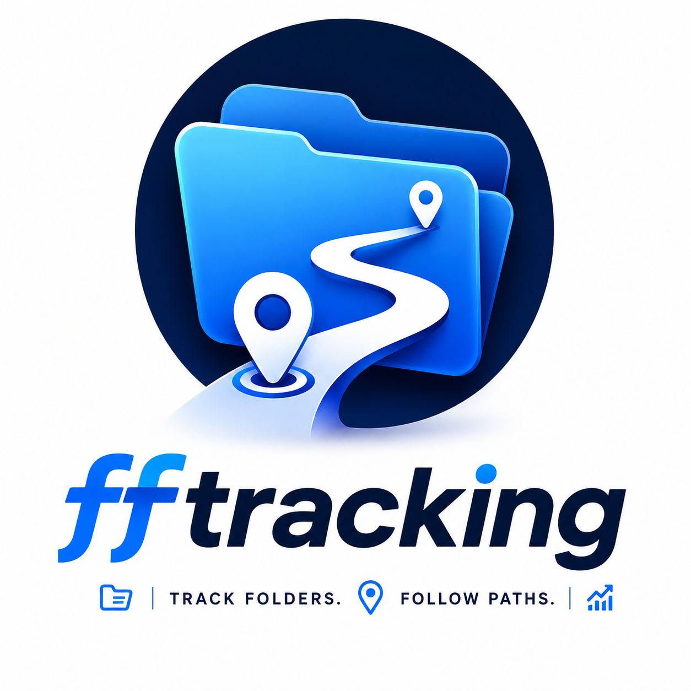
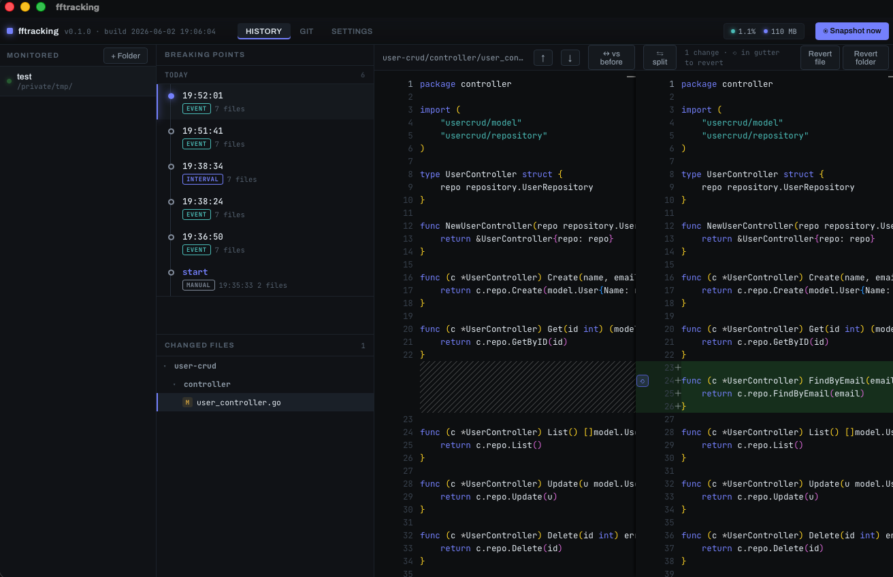
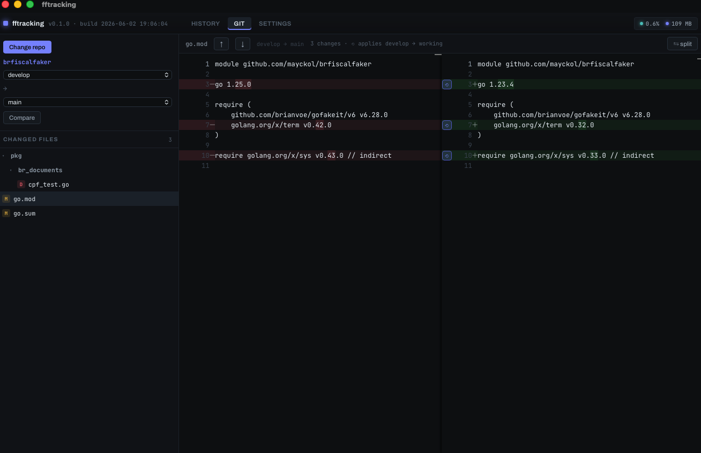
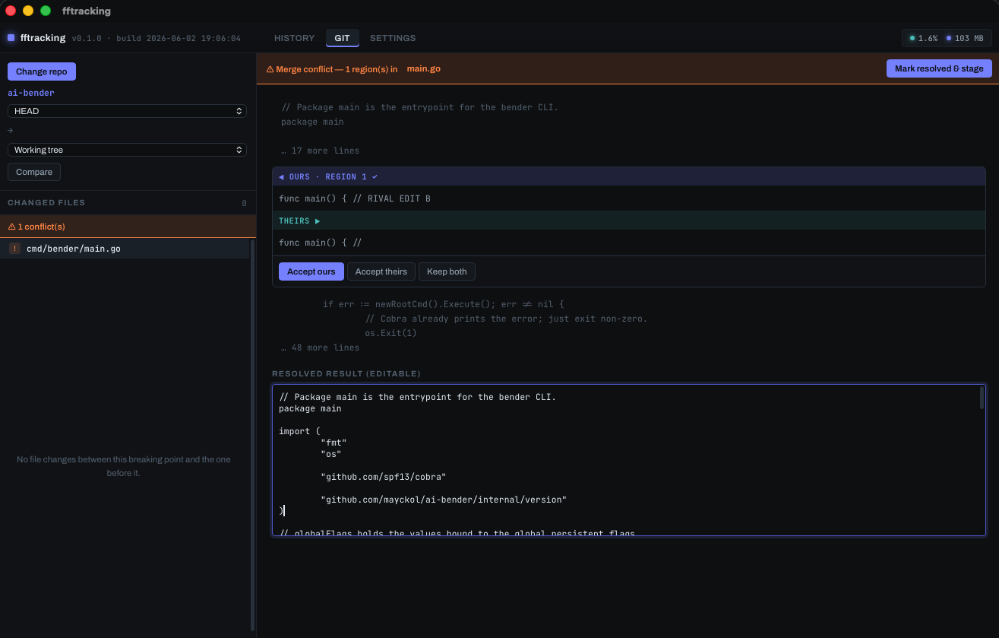

<p align="center">
  <picture>
    <source media="(prefers-color-scheme: dark)" srcset="assets/logo-dark.png" />
    
  </picture>
</p>

<p align="center">
  Local file-history &amp; breaking-point tracker — JetBrains <em>Local History</em> style, independent of git.<br/>
  <b>macOS · Linux</b>
</p>

---

fftracking watches your folders recursively and captures **breaking points**
(snapshots) as you work — on every save and on a timer. Browse the timeline,
diff any point side-by-side, and revert by block, file, or folder. It also has a
local **git compare** tab with per-block revert and a merge-conflict resolver.

Drive it from the desktop app, the **`fft` command line**, or the built-in
**MCP server** so AI agents can checkpoint and revert your work.

<p align="center">
  
</p>

<p align="center"><em>Timeline of breaking points · nested changed-files tree · side-by-side diff with per-block ⟲ revert.</em></p>

## Features

- **Automatic breaking points** — captured on file save (debounced) and on an
  interval; rapid saves coalesce into one point per configurable gap (default 20s).
- **Content-addressed store** — blake3-deduplicated blobs; one changed file in a
  10k-file tree stores a single new blob.
- **JetBrains-style diff** — Monaco side-by-side or inline, change-navigation
  arrows, and an always-visible **⟲ revert icon** on every changed block.
- **Revert anything** — per block (gutter ⟲), per file, or per folder; right-click
  the changed-files tree to revert; in-diff editing with Cmd+Z / Cmd+Shift+Z.
- **Git-aware comparison** — inside a repo, breaking points diff against the
  **current branch (HEAD)** with one-click **Reset to branch**; outside git, against
  the **previous point**. Every point shows added / modified / deleted badges.
- **CLI + MCP** — the headless **`fft`** binary (and an `fft mcp` stdio server)
  drive the same store as the app, so scripts and AI agents can track, snapshot,
  diff, and revert.
- **Labels** — name any breaking point (e.g. "before refactor").
- **Editor auto-detect** — opens a folder in VSCode or Zed and fftracking starts
  tracking the focused workspace automatically (no extensions).
- **Local git** — **stage & commit** (pick files, write a message, commit), diff
  branches / commits / working tree, per-block apply, and a 3-way merge-conflict
  resolver (accept ours / theirs / both).
- **Smart retention** — today stays dense, past days coalesce, anything past the
  window is pruned, and the store is capped (default 1 GB).
- **Lightweight** — runs in the tray, shows live CPU / memory in the title bar.

## Screenshots

### Local git — diff branches, commits, or the working tree

<p align="center">
  
</p>

Compare any two refs (here `develop → main`). Each changed block gets a **⟲**
icon that applies that side's version into your working tree — works branch↔branch
or against the working tree.

### Resolve merge conflicts

<p align="center">
  
</p>

A 3-way resolver per conflict region — **Accept ours / theirs / keep both** — with
an editable result. **Mark resolved & stage** writes the file and stages it.

## Install

### Quick install (macOS / Linux)

```bash
curl -fsSL https://raw.githubusercontent.com/mayckol/fftracking/main/scripts/install.sh | sh
```

Installs the latest release — `fftracking.app` to `/Applications` on macOS
(Apple Silicon), or the AppImage to `~/.local/bin/fftracking` on Linux (x86_64) —
plus the headless **`fft`** CLI (+ MCP server) at `~/.local/bin/fft`.
Pin a version with `FFTRACKING_VERSION=v0.3.1`.

### Homebrew (macOS)

```bash
brew install --cask mayckol/tap/fftracking
```

### From a release

Download the artifact for your OS from the
[Releases](https://github.com/mayckol/fftracking/releases) page:

- **macOS** — `fftracking_<version>_aarch64.dmg` (Apple Silicon). Open the DMG and
  drag **fftracking** to Applications. First launch: right-click → **Open** (the
  build is unsigned).
- **Linux** — `.AppImage` (`chmod +x` then run) or `.deb`
  (`sudo dpkg -i fftracking_<version>_amd64.deb`).

### From source

**Requirements**

- [Rust](https://rustup.rs) (stable) and Cargo
- [Node.js](https://nodejs.org) 18+ and npm
- **macOS**: Xcode Command Line Tools (`xcode-select --install`)
- **Linux**: WebKitGTK + build deps, e.g. on Debian/Ubuntu:

  ```bash
  sudo apt update && sudo apt install -y \
    libwebkit2gtk-4.1-dev build-essential curl wget file \
    libxdo-dev libssl-dev libayatana-appindicator3-dev librsvg2-dev
  ```

**Build & install**

```bash
git clone git@github.com:mayckol/fftracking.git
cd fftracking
npm install
npm run tauri build
```

Bundles land in `target/release/bundle/`:
- macOS: `bundle/macos/fftracking.app` (copy to `/Applications`) and `bundle/dmg/`
- Linux: `bundle/appimage/` and `bundle/deb/`

## Develop

```bash
npm install
npm run tauri dev     # hot-reload app (Vite + Rust)
cargo test -p ffcore  # engine tests
```

### Logs

The app mirrors its webview console output and uncaught errors to **stdout** (the
`npm run tauri dev` terminal) and to a log file you can follow live. On startup it
prints the exact path:

```
📂 ff logs: <app-log-dir>/ff.log  (tail -f to follow)
```

Default locations:

- Linux: `~/.local/share/com.fftracking.app/logs/ff.log`
- macOS: `~/Library/Logs/com.fftracking.app/ff.log`

```bash
tail -f ~/.local/share/com.fftracking.app/logs/ff.log
```

For verbose **keyboard-shortcut** diagnostics — every keypress, the resolved
combo, and why it did or didn't fire — enable the debug channel from the in-app
devtools console, then reload:

```js
ffShortcutsDebug(true)   // snapshot of key detection; disable with ffShortcutsDebug(false)
```

## Usage

1. **+ Folder** (or just open a project in VSCode / Zed — it's picked up automatically).
2. Edit files; breaking points appear in the timeline. **⦿ Snapshot now** forces one.
3. Click a point → a file → see the diff. Toggle **vs before / vs now** and
   **split / inline**. Use **↑ ↓** to jump between changes.
4. Revert with the gutter **⟲**, the **Revert file / folder** buttons, or
   right-click in the changed-files tree. Label a point with **🏷**, delete with **×**.
5. **Git** tab — **Commit** mode to stage files (`+` / `−`), write a message, and
   commit; **Compare** mode to diff two refs (or the working tree), apply blocks,
   and resolve merge conflicts.
6. **Settings** — interval, min gap, retention, disk cap, ignore globs, respect
   `.gitignore` (off by default — like local history), launch on login.

## Command line & AI agents (`fft`)

`fft` is a headless front-end to the same store as the desktop app — anything it
does shows up live in the GUI, and vice versa. The quick-install script and the
Homebrew cask place it at `~/.local/bin/fft`.

```bash
fft track    --path ~/proj                 # start tracking (+ first point)
fft snapshot --path ~/proj --label "wip"   # capture a breaking point now
fft points   --path ~/proj                 # list points with +A ~M -D counts
fft changes  --path ~/proj                 # what changed at the latest point
fft diff     --path ~/proj --file src/a.ts # unified diff vs branch / prev point
fft revert   --path ~/proj --point 42 --file src/a.ts
fft reset    --path ~/proj --file src/a.ts # restore from the current git branch
fft <cmd> --json                           # machine-readable output
fft --help                                 # full reference
```

Comparison follows the same rule as the app: the **current git branch (HEAD)** in
a repo, otherwise the **previous breaking point**.

### MCP (Model Context Protocol)

`fft mcp` is a stdio MCP server exposing `track`, `snapshot`, `points`, `changes`,
`diff`, `revert`, `reset`, `label`, and `untrack` as tools, so an AI agent can
checkpoint and revert your work. Register it (e.g. with Claude):

```bash
claude mcp add fftracking -- fft mcp
```

```json
{ "mcpServers": { "fftracking": { "command": "fft", "args": ["mcp"] } } }
```

## Data

State lives in the OS app-data dir (`db.sqlite` + `objects/<blake3>` blobs):

- macOS: `~/Library/Application Support/com.fftracking.app/`
- Linux: `~/.local/share/com.fftracking.app/`

By default fftracking tracks **everything** (so files like `.env` get history) and
skips heavy dirs (`.git`, `node_modules`, `target`, `dist`, …) plus files > 5 MB.

## Architecture

- **`crates/ffcore`** — Rust engine: watcher (`notify`), content-addressed store
  (blake3 + SQLite), retention/prune, local git (`git2`), editor detection. Fully
  unit-tested, no UI deps.
- **`src-tauri`** — Tauri v2 shell: IPC commands, tray, autostart, detect daemon.
- **`src`** — React + Monaco diff UI.
- **`crates/ffcli`** — the `fft` CLI + stdio MCP server (ffcore only, no UI deps);
  shares the desktop app's data store.

## License

MIT
